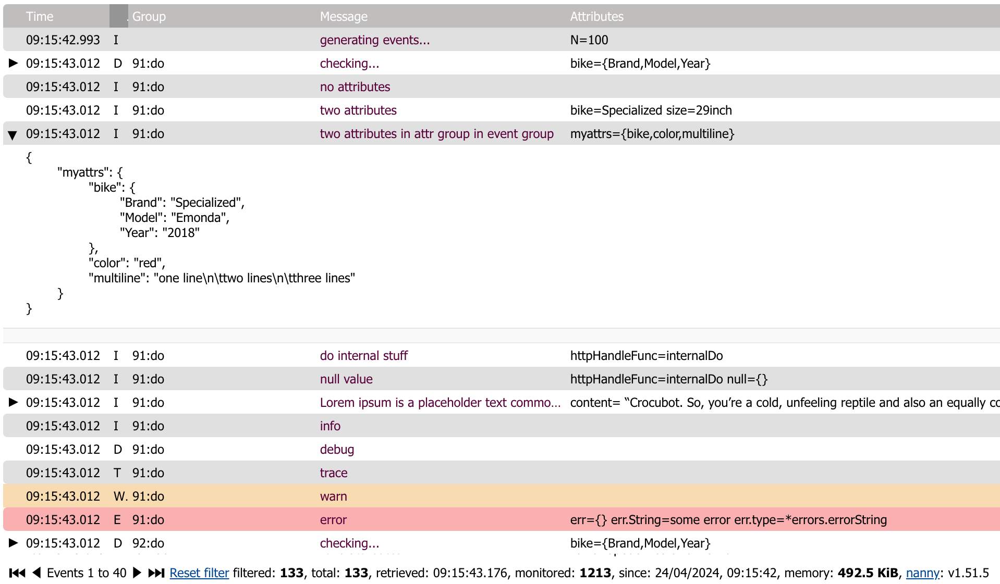

# nanny

[](https://pkg.go.dev/github.com/emicklei/nanny)

Records a sliding window of slog events with all log attribute values for remote inspection through HTTP.



## usage

```go
	import "github.com/emicklei/nanny"

	...

	nanny.SetupDefault()
	slog.Debug("debug", "hello", "world")
```

or by composing the setup yourself:


```go
	r := nanny.NewRecorder()

	// recorder captures debug and forwards to existing handler
	l := slog.New(nanny.NewLogHandler(r, slog.Default().Handler(), slog.LevelDebug)) // or nanny.LevelTrace
	
	// replace the default logger
	slog.SetDefault(l)

	// serve the events
	http.Handle("/nanny", nanny.NewBrowser(r))
```

Then after starting your HTTP service, you can access `/nanny` to see and explore your log events.
 

## event groups

Events can be grouped e.g. by function name or for the processing of a specific HTTP request.

```go
	l := slog.Default().With("trace-id", "some-correlation-value")
	l.Debug("var", "key", "value")
```

Here `trace-id` is an event group marker.
No group markers are set by default.
You can change the group keys to whatever you want using the RecorderOptions `GroupMarkers`.
Typically, events are grouped by an external identifier such as a request id or message id.

```go
	r := nanny.NewRecorder(nanny.RecorderOptions{
		MaxEvents: 1000,
		MaxEventGroups: 100,
		GroupMarkers:[]string{"trace-id"},
		LogEventGroupOnError: true,
	})
```
 
## sample record served as JSON

Access the events via `/nanny?do=events`.

```json
  {
    "t": "2023-11-08T18:15:14.349402+01:00",
    "l": "DEBUG",
    "g" : "some group", 
    "m": "checking...", 
    "a": {
      "bike": {
		"Brand": "Trek",
      	"Model": "Emonda",
      	"Year": "2017"
	  }
    }
```
|field|comment|
|-|-|
|t|timestamp|
|l|log level|
|g|group|
|m|message|  
|a|attributes|

## how it works

Your program calls `slog.Debug` which creates an `slog.Record` which is sent to the default `slog.Handler`.
If the default handler is a `nanny.SlogHandler` then the record is first sent to a `nanny.Recorder`.
The `nanny.Recorder` keeps the last N record copies in memory and adds grouping information to them.
Records from the `nanny.Recorder` are served by the `nanny.Browser` using an HTTP endpoint.

A `nanny.SlogHandler` wraps (decorates) another `slog.Handler`, the fallback handler.
Both the `nanny.SlogHandler` and the fallback handler respond to a certain `slog.Level`.
If the `nanny.SlogHandler` is enabled for the log level of the record then it is sent to fallback handler.
If the fallback handler is enabled for the log level of the record then it is sent to the fallback output.
So if the fallback handler is configured for INFO only then the TRACE and DEBUG records are kept by the `nanny.Recorder` only ; they are not logged to the output of the fallback handler.
